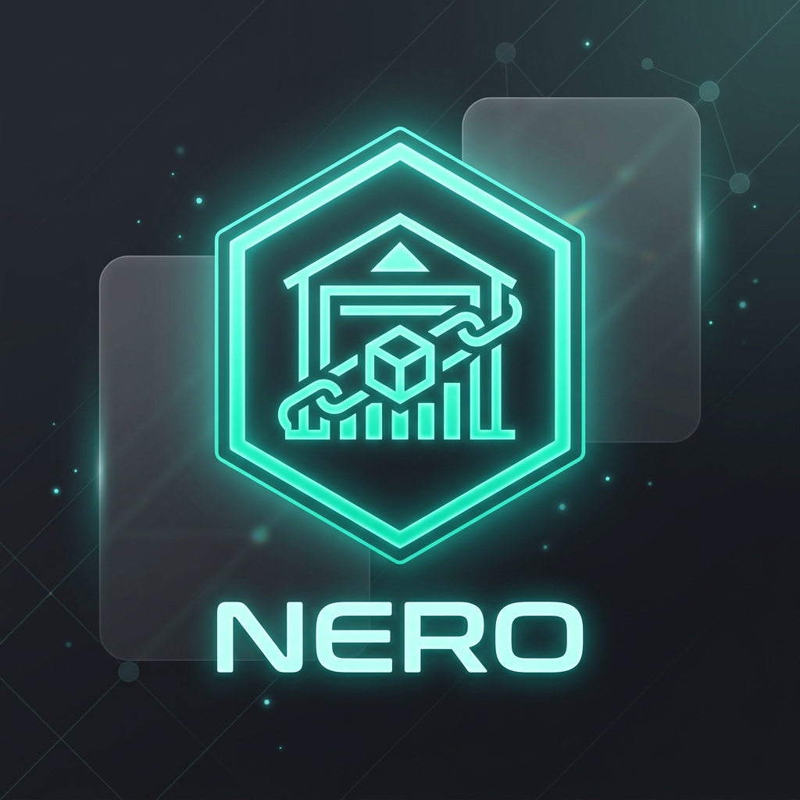
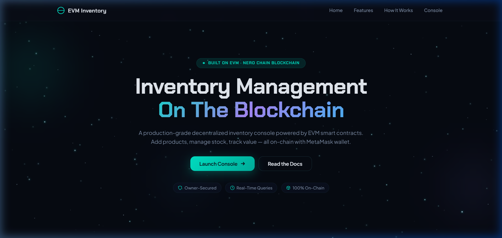
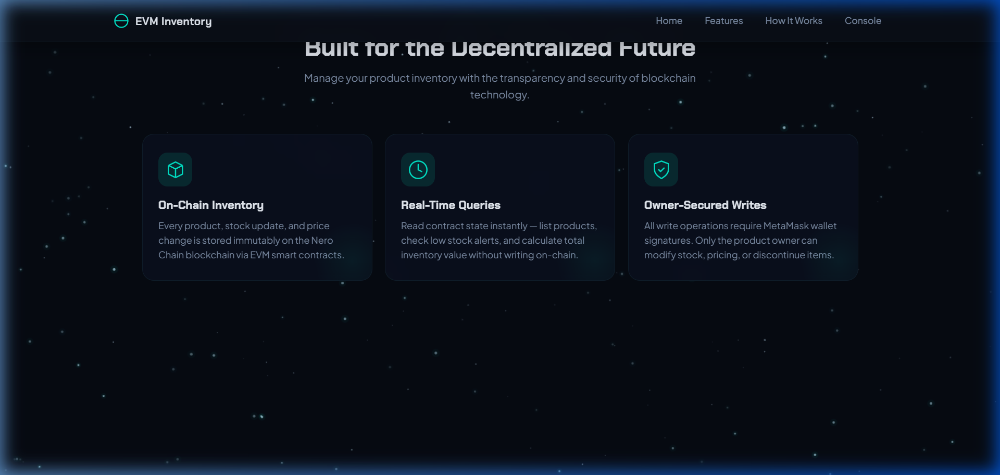
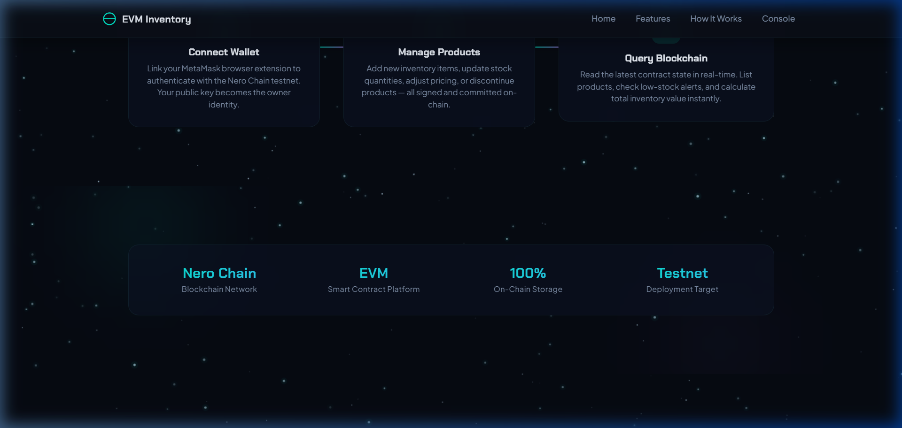
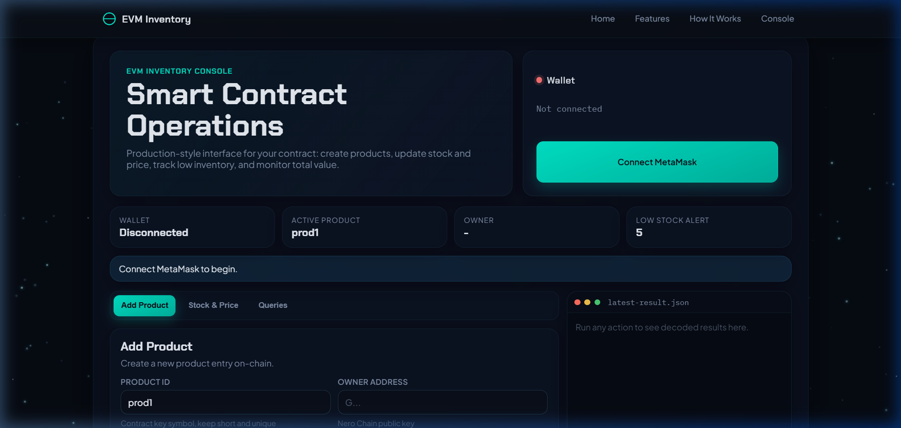
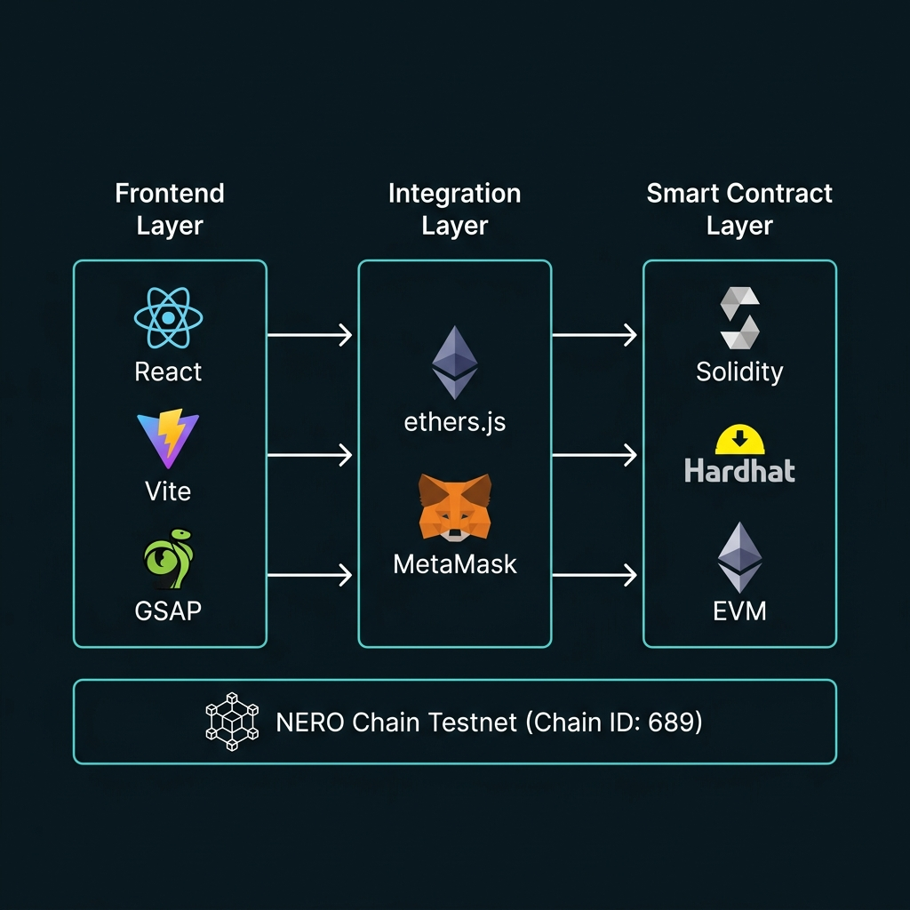

<div align="center">
  
  <h1>NERO Inventory dApp</h1>
  <p>A production-grade, immersive Web3 Inventory Management System built on <b>NERO Chain</b> (EVM), featuring a cinematic GSAP-animated landing page with dark cosmic glassmorphism UI.</p>

  <p>
    <a href="#-quick-start"><b>Quick Start</b></a> • 
    <a href="#-system-architecture"><b>Architecture</b></a> • 
    <a href="#-tech-stack"><b>Tech Stack</b></a> • 
    <a href="#-detailed-setup-guide"><b>Setup Guide</b></a> •
    <a href="#-smart-contract-reference"><b>Contract API</b></a>
  </p>

  <p>
    
    
    
    
    
  </p>
</div>

**Deployed Contract Address:** `0x7b0f413A4011712294229b8F386f1b1d009D5cE2`  
**Network:** NERO Chain Testnet (Chain ID: `689`)  
**Block Explorer:** [View on NeroScan](https://testnet.neroscan.io/address/0x7b0f413A4011712294229b8F386f1b1d009D5cE2)

---

## 🌟 Overview

The **NERO Inventory dApp** is a next-generation decentralized application for supply chain and inventory management, deployed on the **NERO Chain** EVM-compatible blockchain. It demonstrates a seamless integration between:

- A modern, highly interactive **React + Vite** frontend with **GSAP 3D animations**
- **MetaMask** wallet connectivity via **ethers.js**
- A production-ready **Solidity** smart contract deployed using **Hardhat**

The UI features a premium **dark cosmic glassmorphism** design with scroll-triggered 3D animations, particle starfield effects, and smooth micro-interactions — delivering a cinematic Web3 experience.

### Key Features
- 🔗 **On-Chain Inventory** — Every product, stock update, and price change is stored immutably on the NERO blockchain.
- 🦊 **MetaMask Integration** — Seamless wallet connection with automatic NERO Testnet network switching.
- 📊 **Real-Time Analytics** — Query low-stock alerts, total inventory value, and product details directly from the smart contract.
- 🔒 **Owner-Secured Operations** — Only the product creator can modify stock, pricing, or discontinue items (enforced by `onlyOwner` modifier).
- 🎬 **Cinematic UI** — GSAP-powered 3D tilt cards, parallax starfield, animated counters, and staggered scroll reveals.

---

## 📸 Screenshots & Demo

### Full Application Demo


### Hero Section
<p align="center">
  
</p>

### Features & How It Works
<p align="center">
  
  
</p>

### Inventory Console
<p align="center">
  
</p>

---

## 🏗️ System Architecture

The project follows a **Full-Stack Web3 Architecture** where the React frontend communicates with a Solidity smart contract deployed on the NERO Chain Testnet via ethers.js and MetaMask.

<div align="center">
  
</div>

### 1. Frontend Layer (React + Vite)
- **User Interface:** Single-page React application. Users navigate through cinematic scroll sections before reaching the main inventory dashboard.
- **Styling:** Custom Vanilla CSS with CSS Grid, Flexbox, glassmorphism (`backdrop-filter`), and CSS variables for a consistent "dark cosmic" theme.
- **Animations:** Powered by **GSAP** (GreenSock Animation Platform) and `ScrollTrigger` plugin. Features 3D tilt cards, parallax starfield, animated counters, and staggered reveals.

### 2. Web3 / Integration Layer (ethers.js + MetaMask)
- **Connection Provider:** `ethers.js` v6 `BrowserProvider` wrapping `window.ethereum` (MetaMask).
- **Wallet Connection:** Users connect their MetaMask wallet. The dApp reads the user's Ethereum address (`0x...`) to authorize inventory transactions.
- **Automatic Network Switching:** On wallet connect, the dApp checks if MetaMask is on the NERO Testnet (Chain ID `689`). If not, it automatically prompts the user to add and switch to the correct network.
- **Transaction Flow:** Write operations create contract method calls via a `Signer`, which triggers MetaMask's confirmation popup. Read operations use a `Provider` directly — no gas fees, instant results.

### 3. Smart Contract Layer (Solidity / Hardhat)
- **Language:** Solidity `^0.8.28`
- **Framework:** Hardhat 2.x with `@nomicfoundation/hardhat-toolbox`
- **Deployment:** Hardhat Ignition module, deployed to NERO Chain Testnet
- **State Management:** Products are stored in a `mapping(string => Product)` with a separate `string[]` array tracking all product IDs for enumeration.

### End-to-End Flow Example: Adding a Product
1. **User Action:** The user fills out the "Add Product" form in the console UI.
2. **Frontend Encoding:** `nero.js` creates a contract method call via `ethers.Contract.addProduct(...)`.
3. **Wallet Interaction:** MetaMask pops up, showing the transaction details and gas estimate. User clicks "Confirm".
4. **Network Submission:** The signed transaction is broadcast to the NERO Chain Testnet via the RPC endpoint.
5. **Confirmation:** `tx.wait()` resolves once the transaction is mined. The UI updates with a success message and transaction hash.

---

## 🛠️ Tech Stack

| Layer | Technology | Purpose |
|-------|-----------|---------|
| **Frontend** | [React 19](https://react.dev/) + [Vite 8](https://vitejs.dev/) | UI framework and build tool |
| **Animations** | [GSAP](https://gsap.com/) + ScrollTrigger | 3D animations, parallax, scroll effects |
| **Styling** | Vanilla CSS | Glassmorphism, dark theme, CSS Grid |
| **Blockchain SDK** | [ethers.js v6](https://docs.ethers.org/v6/) | Smart contract interaction |
| **Wallet** | [MetaMask](https://metamask.io/) | Transaction signing and account management |
| **Smart Contract** | [Solidity ^0.8.28](https://soliditylang.org/) | On-chain inventory logic |
| **Dev Framework** | [Hardhat 2.x](https://hardhat.org/) | Compilation, testing, deployment |
| **Blockchain** | [NERO Chain Testnet](https://nerochain.io/) | EVM-compatible L1 (Chain ID: 689) |

---

## ⚙️ Detailed Setup Guide

Follow these steps to set up, deploy, and run the project from scratch.

### Prerequisites

1. **Node.js 18+** — Check with:
   ```bash
   node -v
   ```
2. **MetaMask** — Install the [MetaMask browser extension](https://metamask.io/download/).
3. **NERO Testnet Tokens** — You will need testnet NERO to deploy and interact with the contract.

### Step 1: Clone the Repository

```bash
git clone https://github.com/subrata7159-coder/inventory-dapp_NERO.git
cd inventory-dapp_NERO
```

### Step 2: Install Dependencies

```bash
npm install
```

This installs both frontend dependencies (React, GSAP, ethers.js) and smart contract tooling (Hardhat, Solidity compiler).

### Step 3: Configure MetaMask for NERO Testnet

Add the NERO Testnet to your MetaMask wallet manually, or the dApp will prompt you automatically on first connect:

| Setting | Value |
|---------|-------|
| **Network Name** | NERO Testnet |
| **RPC URL** | `https://rpc-testnet.nerochain.io` |
| **Chain ID** | `689` |
| **Currency Symbol** | `NERO` |
| **Block Explorer** | `https://testnet.neroscan.io` |

### Step 4: Fund Your Wallet

Visit the [NERO Chain Testnet Faucet](https://faucet.nerochain.io/) and request testnet NERO tokens for your MetaMask wallet address.

### Step 5: Configure Environment Variables

Create a `.env` file in the project root:

```bash
PRIVATE_KEY=your_wallet_private_key_here
```

> ⚠️ **Security Warning:** Never commit your `.env` file to version control. It is already included in `.gitignore`.

**How to get your private key from MetaMask:**
1. Open MetaMask → Click the three dots (⋯) → **Account Details**
2. Click **Show Private Key** → Enter your MetaMask password
3. Copy the key and paste it into the `.env` file

### Step 6: Compile the Smart Contract

```bash
npx hardhat compile
```

Expected output:
```
Compiled 1 Solidity file successfully (evm target: paris).
```

### Step 7: Deploy the Smart Contract

Deploy to the NERO Testnet:

```bash
npx hardhat ignition deploy ignition/modules/Inventory.js --network neroTestnet
```

When prompted, type `y` to confirm. After deployment, you will see:

```
[ InventoryModule ] successfully deployed 🚀

Deployed Addresses:
InventoryModule#Inventory - 0xYOUR_CONTRACT_ADDRESS
```

### Step 8: Update the Contract Address

Open `lib/nero.js` and replace the `CONTRACT_ADDRESS` with your newly deployed address:

```javascript
export const CONTRACT_ADDRESS = "0xYOUR_CONTRACT_ADDRESS";
```

> **Note:** If you want to use the pre-deployed contract, no changes are needed — the default address `0x7b0f413A4011712294229b8F386f1b1d009D5cE2` is already set.

### Step 9: Run the Development Server

```bash
npm run dev
```

The application will be available at `http://localhost:5173`.

### Step 10: Build for Production

```bash
npm run build
```

This compiles the React code, optimizes GSAP dependencies, and outputs static files to the `dist/` directory ready for deployment to any static hosting service (Vercel, Netlify, etc.).

---

## 📜 Smart Contract Reference

The `Inventory.sol` contract provides the following public methods:

### Write Operations (require MetaMask signature)

| Method | Parameters | Description |
|--------|-----------|-------------|
| `addProduct` | `id`, `name`, `sku`, `quantity`, `unitPrice`, `category` | Creates a new product. The caller's address becomes the owner. |
| `updateStock` | `id`, `quantityChange`, `isAddition` | Adds or removes stock. Only the product owner can call this. |
| `updatePrice` | `id`, `newPrice` | Updates the unit price. Owner-only. |
| `discontinueProduct` | `id` | Marks a product as inactive. Owner-only. Irreversible. |

### Read Operations (free, no gas)

| Method | Parameters | Returns | Description |
|--------|-----------|---------|-------------|
| `getProduct` | `id` | `Product` struct | Returns full details of a single product. |
| `listProducts` | — | `Product[]` | Returns all registered products. |
| `getLowStock` | `threshold` | `Product[]` | Returns active products with quantity below the threshold. |
| `getTotalValue` | — | `uint256` | Sum of `quantity × unitPrice` for all active products. |

### Events

| Event | Emitted When |
|-------|-------------|
| `ProductAdded(id, owner, name)` | A new product is created |
| `StockUpdated(id, newQuantity)` | Stock is added or removed |
| `PriceUpdated(id, newPrice)` | Unit price is changed |
| `ProductDiscontinued(id)` | A product is discontinued |

### Product Struct

```solidity
struct Product {
    string id;        // Unique identifier
    address owner;    // Creator's wallet address
    string name;      // Human-readable name
    string sku;       // Stock Keeping Unit code
    uint256 quantity;  // Current stock level
    uint256 unitPrice; // Price per unit (in wei)
    string category;   // Product category
    bool isActive;     // false if discontinued
}
```

---

## 📁 Project Structure

```
inventory-dapp_NERO/
├── contracts/
│   └── Inventory.sol           # Solidity smart contract
├── ignition/
│   └── modules/
│       └── Inventory.js        # Hardhat Ignition deployment module
├── lib/
│   └── nero.js                 # ethers.js contract interaction layer
├── public/
│   ├── logo.png                # Project logo
│   ├── hero.png                # Hero banner image
│   ├── features.png            # Features section image
│   ├── console.png             # Console screenshot
│   ├── demo-scroll.webp        # Full demo animation
│   ├── favicon.svg             # Browser favicon
│   └── screenshots/            # Live application screenshots
├── src/
│   ├── components/
│   │   ├── Features.jsx        # 3D tilt feature cards
│   │   ├── HowItWorks.jsx      # Animated steps section
│   │   ├── LandingHero.jsx     # Hero section with 3D text
│   │   ├── Navbar.jsx          # Navigation bar
│   │   ├── Starfield.jsx       # Canvas particle background
│   │   └── StatsSection.jsx    # Animated number counters
│   ├── assets/                 # Static images (architecture diagram, etc.)
│   ├── App.jsx                 # Main application + Inventory Console UI
│   ├── App.css                 # Dark theme, glassmorphism styles
│   ├── index.css               # Global resets
│   └── main.jsx                # React entry point
├── .env                        # Private key (NOT committed)
├── .gitignore
├── hardhat.config.js           # Hardhat config with NERO Testnet
├── package.json
├── vite.config.js              # Vite config with node polyfills
└── README.md                   # This file
```

---

## 🔧 Troubleshooting

| Problem | Solution |
|---------|----------|
| `BAD_DATA (value="0x")` error | MetaMask is on the wrong network. Switch to NERO Testnet (Chain ID 689). The dApp should auto-prompt this. |
| `insufficient funds` on deploy | Fund your wallet from the [NERO Faucet](https://faucet.nerochain.io/). |
| `ENOTFOUND` RPC error | Ensure you're using `https://rpc-testnet.nerochain.io` as the RPC URL. |
| MetaMask not detected | Install the [MetaMask extension](https://metamask.io/download/) and refresh the page. |
| Contract methods fail silently | Ensure the `CONTRACT_ADDRESS` in `lib/nero.js` matches your deployed contract. |

---

## 🤝 Contributing

1. Fork the repository
2. Create a feature branch: `git checkout -b feature/my-feature`
3. Commit your changes: `git commit -m "Add my feature"`
4. Push to the branch: `git push origin feature/my-feature`
5. Open a Pull Request

---

## 📄 License

This project is licensed under the MIT License.

---

<div align="center">
  <p>Built on <a href="https://nerochain.io">NERO Chain</a> • Powered by <a href="https://hardhat.org">Hardhat</a> & <a href="https://docs.ethers.org/v6/">ethers.js</a></p>
</div>
